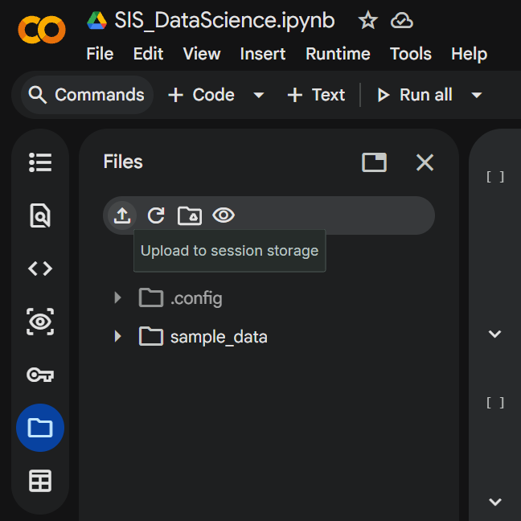

# Gaming Addiction Risk Level Classification Modeling
This is my final project for my 6th semester where I attended Binus University's Specific Independent Study program in their internal Data Science Course. As a 2 person team, we used Python on Google Colab to classify gaming addiction risk based on individuals' behavioral indicators, conducting exploratory data analysis (EDA), data preprocessing, and modeling with XGBoost and SVM using libraries such as pandas, matplotlib, seaborn, and scikit-learn.

For the course output, we also authored an academic research paper on the project to be submitted to a conference, which in our case was ICORIS 2026.

## Dataset used
The dataset we used is publicly available on the Mendeley Data repository titled “[Gaming and Mental Health](https://data.mendeley.com/datasets/gnmkhkbxty/1)”, published by Gagan Randhawa on March 18, 2026.  
This dataset is distributed under a [Creative Commons Attribution 4.0 International (CC BY 4.0)](https://creativecommons.org/licenses/by/4.0/) licence allowing free use, sharing, and modification with proper attribution to the original creators.

## Running the project
The notebook can be viewed and run here on Google Colab:  
https://colab.research.google.com/drive/1xZfBvJKBdYRTicj6P4FSEf0OXgUirjqj?usp=sharing

1. Download `Gaming and Mental Health.csv`, whether from this repository or the Mendeley Data repository.
2. Click the folder icon on the left sidebar and wait for the runtime to connect.
3. Click the `Upload to session storage` button and upload `Gaming and Mental Health.csv`.
   

     
   

4. Click `Run all` to run the project.
